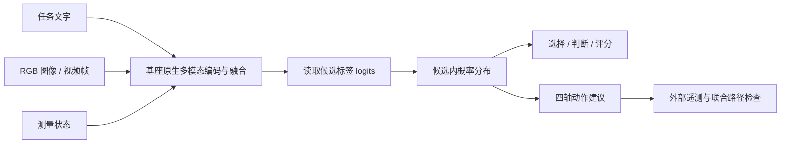

<div align="center">

# System One
### 全模态 System One 决策模型

**看见环境，读懂任务，给出明确选择。**

基于 Gemma 3n、MiniCPM-V 与 InternVL 的开源多模态决策实现

[](LICENSE)
[](https://github.com/maolinqi/multimodal-decision-models/actions/workflows/tests.yml)
[](#模型基座)
[](docs/base-retention-results.md)

[项目故事](#从看懂一帧画面开始) · [决策通路](#一次前向直接读出决策) · [模型基座](#模型基座) · [基座对比](#改造之后基座的行为还在吗) · [快速开始](#快速开始) · [开源范围](#开源范围与许可)

</div>

---

## 从看懂一帧画面开始

一帧画面里，红色目标出现在左侧。系统收到一个问题：“目标在哪一侧？”

这时，模型的回答需要进入程序的下一步：返回一个稳定的选项，列出其他候选的概率，留下可核查的输入和推理记录。在动作决策中，还需要把视觉观测与速度、高度、目标误差等测量状态放在一起，形成结构化的动作建议。

**System One 从这个接口需求出发：让多模态模型的理解能力进入决策通路。**

我们延续 Qwen3-VL 多模态决策台的改造经验，将同一套观测与决策协议扩展到 Gemma-3n-E4B / E2B、MiniCPM-V-4.5 和 InternVL3.5-8B / 14B。文字、图像、视频帧与测量状态经过基座原生多模态融合，再被读出为候选选择、真假判断、等级评分或四轴动作建议。

> **v0.1 已开放：** 文字、RGB 图像、带时间戳的视频抽帧、测量状态和五个原生模型适配器。全模态是项目的拓展方向；音频、深度和其他传感器通路尚未接入或验证。

## 一次前向，直接读出决策

本项目用 **System One** 表示从当前观测直接到结构化选择的通路。对于一次候选决策，模型完成一次语言模型前向，读取最后位置的候选标签 logits，然后计算候选集合内的概率。

**生产决策路径生成 0 个新文本 token，直接返回结构化候选分布。**



| 决策类型 | 解决的问题 | 返回结果 |
|---|---|---|
| `choice` | 从 2–26 个已定义选项中选择 | 稳定选项 ID 与候选概率 |
| `noul` | 判断一个陈述是否成立 | true/false 与对应概率 |
| `score` | 在有序等级中评分 | 等级分布与期望分数 |
| `velocity4` | 选择 vx、vy、vz、yaw-rate | 四个分量的分布与动作建议 |

四轴各使用七档，覆盖 2401 种组合；一次四轴建议需要四次语言模型前向。各分量概率不构成联合安全概率，动作建议默认 `executable=false`。

候选概率表示当前选项之间的相对偏好，尚未校准为正确率。

## 从同一套协议，走向五个基座

模型之间的差异，首先出现在视觉信息如何进入语言模型。Gemma、MiniCPM 与 InternVL 各有自己的预处理、视觉编码和融合实现。我们的工作是为它们逐个建立原生适配，保留这些通路，再用同一套协议连接到决策读出和网页。

| 我们实现的部分 | 具体内容 |
|---|---|
| **原生模型适配** | Gemma processor / forward；MiniCPM 图像切片、视觉重采样和 embedding 融合；InternVL 动态切片与视觉 token 融合 |
| **统一观测协议** | 按相机和时间戳组织 RGB 帧，接收可测量状态，拒绝无效数值和特权状态字段 |
| **统一决策读出** | 候选标签必须是单 token，使用基座已有语言头的 logits；不新增训练后的决策头 |
| **四轴动作与检查函数** | 保留统一动作协议，提供时效、刹车距离和联合路径检查函数；执行由外部系统负责 |
| **统一决策台与 API** | 同一页面切换五个模型，可接入已有 Qwen 服务，按需加载并管理单模型驻留 |
| **可复现验证** | 固定输入、原生对照、协议测试、实际 GPU 记录和失败样本一并公开 |

## 模型基座

| model_id | 官方基座 |
|---|---|
| `gemma-e4b` | [google/gemma-3n-E4B-it](https://huggingface.co/google/gemma-3n-E4B-it) |
| `gemma-e2b` | [google/gemma-3n-E2B-it](https://huggingface.co/google/gemma-3n-E2B-it) |
| `minicpm-v45` | [openbmb/MiniCPM-V-4_5](https://huggingface.co/openbmb/MiniCPM-V-4_5) |
| `internvl35-8b` | [OpenGVLab/InternVL3_5-8B](https://huggingface.co/OpenGVLab/InternVL3_5-8B) |
| `internvl35-14b` | [OpenGVLab/InternVL3_5-14B](https://huggingface.co/OpenGVLab/InternVL3_5-14B) |

可通过 `QWEN_DECISION_URL` 接入已有的兼容 Qwen 服务。

本版本直接使用官方基座权重，未进行决策微调。

## 改造之后，基座的行为还在吗？

接口能运行之后，我们继续追问：视觉信息是否正确融合？共享缓存是否改变了计算？读出的选择能否与原生模型一致？

为回答这些问题，我们让每个基座完成同一组 **20 个固定探针**：文字计算与逻辑、颜色、计数、OCR、位置关系、双图判断和时序变化。每个输入分别经过官方原生生成第一步和本项目决策前向，控制权重、已预处理输入、提示、候选集、精度和注意力实现。

| 模型 | 原生对照正确数 | 决策改造正确数 | 决策一致率 | 完整词表 logits 最大差 |
|---|---:|---:|---:|---:|
| Gemma-3n-E2B-it | 16/20 | 16/20 | 100% | 0 |
| Gemma-3n-E4B-it | 16/20 | 16/20 | 100% | 0 |
| MiniCPM-V-4.5 | 20/20 | 20/20 | 100% | 0 |
| InternVL3.5-8B | 19/20 | 19/20 | 100% | 0 |
| InternVL3.5-14B | 20/20 | 20/20 | 100% | 0 |

**100 组配对中，候选决策全部一致；完整词表 logits 和候选概率最大差均为 0。** 运行期间参数对象和版本计数未变化。基座答错的样本也保留在报告中，正确数由同一批固定输入计算。

**在已测输入与配置下，决策改造保持了基座的原生第一步计算及候选决策行为。** 这组固定探针用于改造前后对照，不代表完整能力评测或跨模型排名；输入配置与评测边界见下方对照方法。

[查看对照方法](docs/base-retention.md) · [查看完整结果](docs/base-retention-results.md) · [查看固定输入](benchmarks/base_retention_v1.json) · [查看原始记录](evidence/retention/)

## 现在可以怎样使用它？

你可以在统一决策台中上传图像或视频片段，填写问题与候选选项，切换模型，查看和导出决策分布。视频通过带时间戳的 RGB 抽帧输入，最多 8 帧，不包含音轨。

在程序中，可以通过统一 API 接入四种决策类型。视觉候选选择、有限事件判断和基于测量状态的动作建议，都可以使用同一协议开展实验。四轴输出需要外部最新遥测和联合路径检查后才能进入执行器；本项目尚未证明闭环导航改进或真实飞行成功。

## 快速开始

Linux、Python 3.12、NVIDIA GPU；已测试 PyTorch 2.8.0、Transformers 4.57.1 和 BF16。以下以 MiniCPM-V-4.5 为例：

```bash
git clone https://github.com/maolinqi/multimodal-decision-models.git
cd multimodal-decision-models
./setup.sh
.venv/bin/python scripts/download_models.py minicpm-v45
CUDA_VISIBLE_DEVICES=0 ./start_all.sh
```

浏览器打开 [本地决策台](http://127.0.0.1:8456)，选择已下载的模型。视频需要系统已有 `ffmpeg` 和 `ffprobe`。停止服务使用 `./stop_all.sh`；启动脚本只使用已有项目环境，不重复安装依赖。

```bash
curl -H 'Content-Type: application/json' \
  --data-binary @examples/choice.json http://127.0.0.1:8457/decide
```

<details>
<summary>下载其他模型、已有模型目录与显存要求</summary>

Gemma 模型需要在 Hugging Face 接受上游条款并登录：

```bash
.venv/bin/hf auth login
.venv/bin/python scripts/download_models.py gemma-e2b gemma-e4b internvl35-8b internvl35-14b
```

已下载权重可通过 `MODEL_ROOT=/path/to/models` 指向共享模型目录；下载和启动使用同一个变量。单后端按需加载，一个时刻驻留一个模型。显存预留门槛为 E2B 16 GiB、E4B 20 GiB、MiniCPM / InternVL 8B 22 GiB、InternVL 14B 34 GiB；长输入可能需要更多。

总输入上限为 8192 tokens，超限返回错误。当前使用有限切片预算；安装后的网页服务依赖仓库中的 `web/`，建议保留 checkout 和 editable 安装。服务默认绑定本机。

</details>

## 复现验证

```bash
.venv/bin/python -m pytest -q
CUDA_VISIBLE_DEVICES=0 .venv/bin/python scripts/compare_base_retention.py minicpm-v45 \
  --out evidence/retention/minicpm-v45.json
.venv/bin/python scripts/summarize_retention.py
```

CPU 协议与安全边界测试 **11 项通过**。最后一条命令核查并汇总仓库中的五份完整配对记录。单模型接口验证另见 `scripts/validate_model.py`；已有 Gemma 及新增三个模型的结果见 [验证记录](docs/validation.md)。

## 下一步：让决策通路覆盖更多观测

当前开放版本建立了文字、RGB 视觉与测量状态的决策通路。我们希望沿着可复现验证逐步扩展：

- 接入音频、深度与其他传感器，并分别验证编码和融合路径。
- 使用真实任务数据开展原生默认配置与决策配置的配对评测。
- 探索决策微调与概率校准，公开基座对照、错误样本和校准指标。
- 研究视觉特征复用与多问题推理，记录真实延迟与计算成本。
- 在仿真中检验闭环行为，再评估物理系统部署。

## 开源范围与许可

**运行代码已公开开源。** 你可以下载、运行、检查实现并复现对比：

```text
src/multimodal_decision/  原生适配、协议、安全检查、API 与网页网关
web/                     统一决策台
scripts/                 下载、接口验证、基座配对比较与汇总
benchmarks/              固定输入探针
evidence/                实际验证记录，含错误样本
tests/                   协议与安全边界测试
docs/                    架构、对照方法与验证结果
setup.sh / start_all.sh / stop_all.sh
```

自有接口代码采用 **Apache-2.0**。官方模型权重与运行时加载的自定义代码遵循各自上游条款，详见 [模型许可说明](docs/model-licenses.md)。模型权重通过上游渠道下载。

欢迎使用固定输入报告问题，或提交模型适配与验证改进，见 [贡献说明](CONTRIBUTING.md)。
