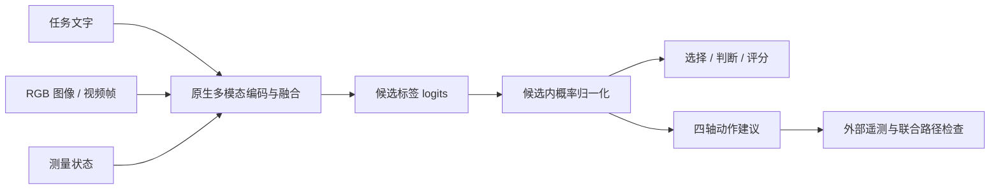

<div align="center">

# System One
### 全模态 System One 决策模型

**从多模态观测到结构化决策与动作建议**

An open-source decision layer for multimodal observations.

[](LICENSE)
[](https://github.com/maolinqi/multimodal-decision-models/actions/workflows/tests.yml)
[](docs/architecture.md)
[](#模型基座)

[项目介绍](#项目介绍) · [我们的工作](#我们的工作) · [模型基座](#模型基座) · [快速开始](#快速开始) · [验证记录](docs/validation.md) · [开源范围](#开源范围与许可)

</div>

---

## 项目介绍

**System One 是面向全模态观测的开源决策模型项目。** 我们将视觉语言基座的多模态理解能力接入结构化决策通路：融合任务文字、视觉观测与测量状态，直接输出候选选择、真假判断、等级评分和四轴动作建议，供上层应用或控制器使用。

本项目中的 **System One** 指从当前观测直接进行受限候选决策的通路。单次候选决策通过一次语言模型前向读取候选 logits；四轴动作建议由四个分量决策组成。网页和 API 共用相同协议，结果可以记录、核查和复现。

**当前开放版本：** 文字、RGB 图像、带时间戳的视频抽帧、测量状态，以及五个原生模型适配器。**全模态拓展方向：** 音频、深度与其他传感器观测；这些通路尚未在本版本接入或验证。

## 我们的工作

| 改造方向 | 本项目实现 |
|---|---|
| **多模态观测 → 决策** | 保留基座原生视觉编码与语言融合，从候选标签 logits 输出稳定决策 ID 和候选概率 |
| **统一决策协议** | `choice` 候选选择、`noul` 真假判断、`score` 等级评分、`velocity4` 四轴动作建议 |
| **时序观测与测量状态** | 按相机与时间戳组织 RGB 帧，融合可测量状态，拒绝特权信息与无效输入 |
| **四轴动作表示** | vx、vy、vz、yaw-rate 各七档，覆盖 2401 种组合；配套独立的时效、刹车距离与联合路径检查函数 |
| **多基座决策模型** | 适配 Gemma-3n-E4B / E2B、MiniCPM-V-4.5、InternVL3.5-8B / 14B，沿用 Qwen3-VL 决策协议 |
| **统一决策台** | 同一网页切换模型，共用输入与候选选项，输出决策分布、视觉通路信息和推理记录 |
| **可复现开源实现** | 发布模型适配、API、前端、环境与启停脚本、协议测试和实际 GPU 验证记录 |

## 决策通路



结果使用稳定 ID，直接返回候选概率分布，无需解析自由文本回答。概率表达当前候选集合内的相对偏好；四轴分量分布不构成联合安全概率。动作建议默认 `executable=false`，外部系统负责执行前检查。

## 已开放的能力

| 输入或输出 | v0.1 状态 |
|---|---|
| 任务文字与结构化测量状态 | 已实现 |
| RGB 图像与多图观测 | 已实现 |
| 视频 | 带时间戳的 RGB 抽帧，最多 8 帧；不含音轨 |
| 候选选择 / 真假判断 / 等级评分 | 已实现 |
| 四轴速度动作建议 | 已实现，默认不执行 |
| 音频、深度、其他传感器 | 路线图 |
| 决策微调权重与学习性能提升 | 本版本未发布 / 未验证 |

**验证进展：** CPU 协议与安全边界测试 11 项通过。MiniCPM-V-4.5、InternVL3.5-8B 和 14B 均完成真实 GPU 接口验证，候选 logits 与官方生成第一步的最大绝对差为 0。Gemma 的既有验证结果也已公开。小型合成探针与接口一致性检查不等于真实任务性能评测，完整结果见 [验证记录](docs/validation.md)。

## 模型基座

| model_id | 官方基座 | 适配方式 |
|---|---|---|
| `gemma-e4b` | [google/gemma-3n-E4B-it](https://huggingface.co/google/gemma-3n-E4B-it) | 原生 Gemma3n processor / conditional-generation forward |
| `gemma-e2b` | [google/gemma-3n-E2B-it](https://huggingface.co/google/gemma-3n-E2B-it) | 原生 Gemma3n processor / conditional-generation forward |
| `minicpm-v45` | [openbmb/MiniCPM-V-4_5](https://huggingface.co/openbmb/MiniCPM-V-4_5) | 原生图像切片、视觉重采样、语言模型 embedding 融合 |
| `internvl35-8b` | [OpenGVLab/InternVL3_5-8B](https://huggingface.co/OpenGVLab/InternVL3_5-8B) | 原生动态切片、视觉特征与 IMG_CONTEXT token 融合 |
| `internvl35-14b` | [OpenGVLab/InternVL3_5-14B](https://huggingface.co/OpenGVLab/InternVL3_5-14B) | 同上 |

决策协议沿用 Qwen3-VL 决策台的 `choice`、`noul`、`score` 和 `velocity4` 接口。可通过 `QWEN_DECISION_URL` 接入已有的兼容 Qwen 服务。

## 快速开始

Linux、Python 3.12、NVIDIA GPU；实测环境为 PyTorch 2.8.0、Transformers 4.57.1、BF16。模型只按需加载，一个后端同时驻留一个模型。预留显存门槛分别为 E2B 16 GiB、E4B 20 GiB、MiniCPM/InternVL 8B 22 GiB、InternVL 14B 34 GiB；长输入可能需要更多。

```bash
git clone https://github.com/maolinqi/multimodal-decision-models.git
cd multimodal-decision-models
./setup.sh
# Gemma 需要先在 Hugging Face 接受模型条款并登录。
.venv/bin/hf auth login
.venv/bin/python scripts/download_models.py gemma-e2b gemma-e4b minicpm-v45 internvl35-8b internvl35-14b
CUDA_VISIBLE_DEVICES=0 ./start_all.sh
```

浏览器打开 http://127.0.0.1:8456，在同一个页面切换模型。视频抽帧需要系统已有 `ffmpeg`、`ffprobe`。启动脚本不会重复安装依赖；停止使用 `./stop_all.sh`。已下载模型可通过 `MODEL_ROOT=/path/to/models` 指向共享模型目录，下载与启动时使用同一个变量。

安装后的 gateway 需要仓库中的 `web/`，因此建议保留 Git checkout 并使用上述 editable 安装。服务默认绑定本机，不包含公开隧道或生产身份验证。

## API

```bash
curl http://127.0.0.1:8457/health
curl -H 'Content-Type: application/json'   --data-binary @examples/choice.json http://127.0.0.1:8457/decide
```

图像通过 `images` 数组传入，每项包含 `base64`（无 data URI 前缀）、`camera_id` 和 `timestamp_ms`。视频以按时间排列的 RGB 抽帧输入，不接收音轨。最多 8 帧，总输入上限 8192 tokens，超限报错而不是截断。InternVL 使用最多四个动态 tile 加缩略图，MiniCPM 使用最多四个切片；这是一种有限计算预算配置。

`choice` 使用 2–26 个稳定 ID 映射到 A–Z；`noul` 返回 true/false；`score` 返回等级概率与期望分数。`velocity4` 分别选择 vx、vy、vz、yaw-rate 的七档，共 2401 种组合。每个分量一次语言模型前向，共四次，独立分量分布不是联合安全概率。动作默认 `executable=false`，需要外部实时遥测与联合路径检查。见 [接口说明](docs/architecture.md)。

## 可复现验证

```bash
.venv/bin/python -m pytest -q
CUDA_VISIBLE_DEVICES=0 .venv/bin/python scripts/validate_model.py minicpm-v45 --out evidence/minicpm-v45.json
```

验证脚本检查图像进入视觉通路、候选概率归一化、四种接口与官方原生生成第一步的候选 logits 一致性。小型合成图像探针不等于现实泛化评测。最新实际结果见 [验证记录](docs/validation.md)。Gemma 既有验证中 E4B 的 `2+3` 探针曾选错，保留这一限制。

没有附带训练后的 LoRA，没有将接口改造描述为学习能力提升。对输入状态的约束和安全门不替代真实系统安全验证。

## 全模态路线图

- [x] 发布五个模型的原生多模态决策适配器。
- [x] 统一观测、候选决策和四轴动作协议。
- [x] 开源决策台、API、运行脚本与验证记录。
- [ ] 接入音频与其他传感器，并为每条新增通路提供独立验证。
- [ ] 构建真实任务决策数据与同状态、同场景的配对评测。
- [ ] 开展决策微调与基座对照，公开正面及负面结果。
- [ ] 验证闭环仿真与执行边界，再评估物理系统部署。

## 项目结构

```text
src/multimodal_decision/  模型适配、协议、安全门、API 与网页网关
web/                     统一前端
scripts/                 模型下载与真实 GPU 验证
examples/                请求示例
tests/                   CPU 协议与安全边界测试
docs/                    架构、验证和贡献说明
evidence/                脱敏后的实际验证记录
setup.sh / start_all.sh / stop_all.sh
```

## 开源范围与许可

**本项目运行代码已公开开源。** 发布内容包括原生模型适配器、决策协议、安全检查函数、后端 API、网页前端、下载和启停脚本、示例、测试与验证记录。

本仓库自有接口代码采用 Apache-2.0；模型权重与运行时加载的官方自定义代码仍遵循各自上游条款，见 [模型许可说明](docs/model-licenses.md)。仓库不含模型权重、账户凭据或部署信息。欢迎提交 issue 与 PR，见 [CONTRIBUTING.md](CONTRIBUTING.md)。
